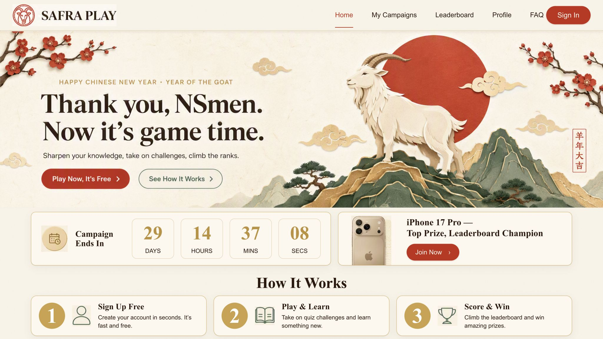

# SAFRA Play — Lunar New Year 2027

Year of the Goat seasonal skin, developed from the existing SAFRA Play prototype.

## Preview

Run `npm ci`, then `npm run dev -- --host 127.0.0.1`. Open the local address printed by Vite. `npm run build` creates the standalone site in `dist/`; `npm run preview` serves that build. The root HTML pages can also be served directly by a static web server.

## Design

Rice-paper cream, vermilion actions, antique gold details and jade accents. The thirteen supplied 2048 × 1152 references guide the desktop composition. Original PNGs are retained in `assets/references/`; CSS clips the logos, illustrated banners and decorative panels without altering the source images. Forms, navigation, filters, accordions, charts and game controls remain HTML/SVG. Some illustrated banners contain reference text; their links and accessible labels are supplied separately.

`assets/screens-reference.css` contains the shared reference layouts and mobile adaptations. `assets/campaigns-reference.css` contains the campaign listing layout, and `assets/theme.css` supplies the base components. All fifteen existing pages remain available; thirteen have supplied screen references. Desktop layouts scale proportionally above 760px, while phones use stacked layouts.

## Integration boundary

This repository is a visual and interaction prototype, not the production SAFRA application. Sign-in and OTP are simulated; campaign participation is local browser state; scores, dates, prize details and profile data are illustrative. Confirm campaign rules and connect the existing production authentication, APIs, consent and legal links before release. This push does not deploy to play.safra.sg.

Apply the palette and components to the production templates, preserving its routes, validation and API behavior. The reference screens omit the preview strip to follow the approved visual compositions. This does not change the simulated nature of their content or services.

## Verification

With the static site running at port 7102, open a Playwright CLI session and run `playwright-cli run-code --filename=tests/verify.js`. It checks all fifteen pages at desktop and phone widths, images, JavaScript errors and the home CTA, FAQ and memory cards.

## Screenshots

[Phone preview](docs/mobile-preview.png)

The reference revision is checked in the in-app browser at 2048px and 390px. See `docs/reference-verification.md` for the latest checks and limits. The inherited Vite 5 development toolchain reports two npm audit advisories; serve development previews on loopback only and update tooling before shared development hosting.
